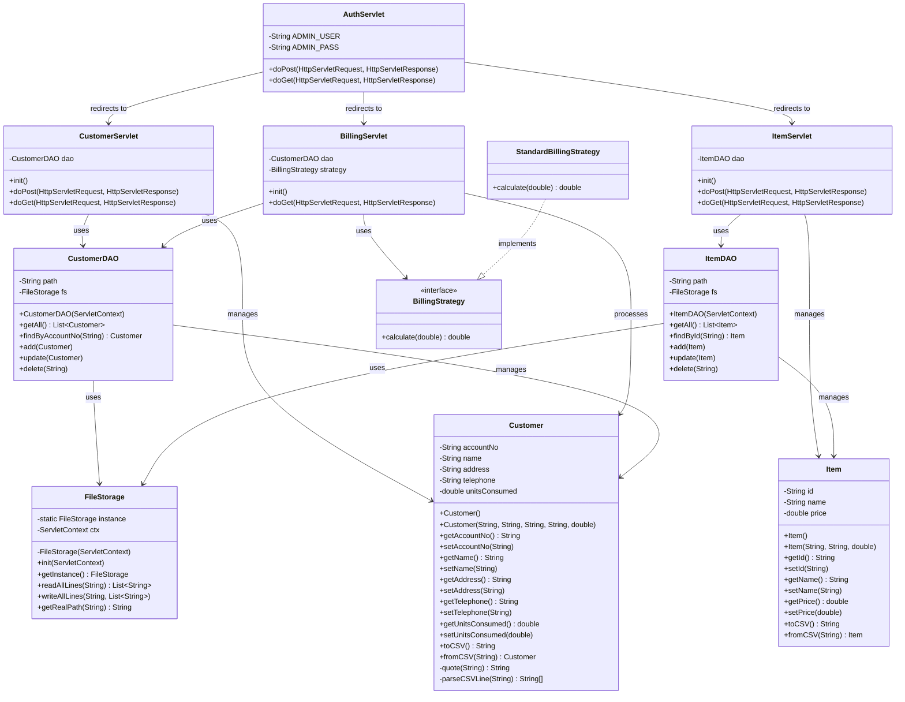

# Pahana Edu Billing System - Class Diagram

## Overview
This document provides a comprehensive class diagram for the Pahana Edu Billing System, a Jakarta EE web application for managing customers, items, and billing.

## Class Diagram



## Class Descriptions

### Servlet Layer
- **AuthServlet**: Handles user authentication (login/logout) with hardcoded admin credentials
- **CustomerServlet**: Manages customer CRUD operations (Create, Read, Update, Delete)
- **ItemServlet**: Manages item CRUD operations for inventory
- **BillingServlet**: Handles billing calculations and bill generation

### Model Layer
- **Customer**: Represents customer data with CSV serialization/deserialization support
- **Item**: Represents inventory items with basic CSV support

### Data Access Layer
- **CustomerDAO**: Data Access Object for customer operations using file-based storage
- **ItemDAO**: Data Access Object for item operations using file-based storage
- **FileStorage**: Singleton utility class for file I/O operations

### Business Logic Layer
- **BillingStrategy**: Interface for billing calculation strategies
- **StandardBillingStrategy**: Implementation of tiered billing calculation


## Key Design Patterns

1. **MVC Pattern**: Servlets (Controller), JSPs (View), Models (Model)
2. **DAO Pattern**: Data Access Objects for database/file operations
3. **Strategy Pattern**: BillingStrategy interface for different billing algorithms
4. **Singleton Pattern**: FileStorage for centralized file operations
5. **Factory Pattern**: CSV parsing methods in model classes

## Data Flow

1. **Authentication**: AuthServlet → Session Management
2. **Customer Management**: CustomerServlet → CustomerDAO → FileStorage → CSV Files
3. **Item Management**: ItemServlet → ItemDAO → FileStorage → CSV Files
4. **Billing**: BillingServlet → CustomerDAO → BillingStrategy → Bill Generation

## File Structure
```
src/java/com/pahanaedu/
├── servlet/          # Controller layer
├── model/           # Data models
├── dao/             # Data access layer
├── storage/         # File storage utilities
└── billing/         # Business logic
```

This class diagram shows a well-structured Jakarta EE application with clear separation of concerns and proper layering.
